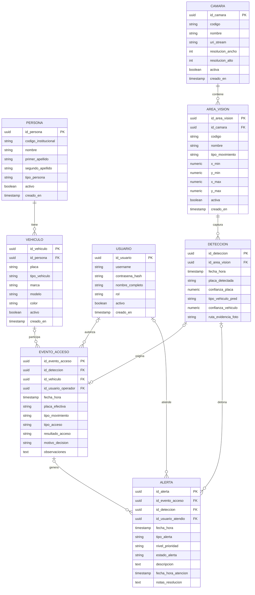

# Modelo Lógico de Base de Datos — VIGIA Vision Systems V1

**Estado del Modelo:** `CONGELADO OFICIALMENTE`  
**Versión:** 1.0 (Línea Base Congelada — VIGIA V1)  
**Motor Oficial de Base de Datos:** PostgreSQL  
**Fecha de Congelación:** Octubre 2026  
**Alcance:** Caseta Inteligente de Acceso Vehicular (Proyecto Escolar de Ingeniería de Software)

---

## 1. Objetivo del Documento

El propósito de este documento es definir y formalizar visualmente el **Modelo Lógico de Base de Datos para VIGIA V1** mediante diagramas entidad-relación (**Mermaid ER**) y especificaciones relacionales rigurosas.

Este modelo representa fielmente las entidades, atributos, restricciones de integridad y reglas operativas del ciclo de control de acceso ciberfísico en lazo cerrado (*Closed-Loop*), manteniendo una estructura normalizada orientada a evitar redundancias y dependencias innecesarias, adaptada a las capacidades del motor **PostgreSQL**.

---

## 2. Diagrama Entidad-Relación Lógico (Mermaid ER)



---

## 3. Catálogo de Entidades y Atributos

El modelo lógico se compone de exactamente **8 entidades**, divididas conceptualmente entre catálogos institucionales, configuración de dispositivos, observaciones sensoriales y auditoría transaccional:

### 3.1 `PERSONA` (Padrón Institucional)
Representa a los miembros de la comunidad educativa autorizados para registrar vehículos en la institución (alumnos, docentes, personal administrativo).
* `id_persona` (`PK`, `UUID`): Identificador único inmutable.
* `codigo_institucional` (`VARCHAR(20)`, `UNIQUE`): Matrícula estudiantil o número de nómina de empleado.
* `nombre` (`VARCHAR(60)`): Nombre(s) de la persona.
* `primer_apellido` (`VARCHAR(50)`): Primer apellido paterno.
* `segundo_apellido` (`VARCHAR(50)`, `NULL`): Segundo apellido materno (opcional).
* `tipo_persona` (`VARCHAR(20)`): Clasificación institucional (`'ALUMNO'`, `'DOCENTE'`, `'ADMINISTRATIVO'`).
* `activo` (`BOOLEAN`): Indicador de vigencia institucional para borrado lógico (`TRUE` por defecto).
* `creado_en` (`TIMESTAMP WITH TIME ZONE`): Fecha y hora de alta en el sistema.

### 3.2 `VEHICULO` (Lista Blanca Institucional)
Representa el parque vehicular registrado y acreditado para acceder a las instalaciones.
* `id_vehiculo` (`PK`, `UUID`): Identificador único del vehículo.
* `id_persona` (`FK`, `UUID`): Identificador del titular o responsable (`NOT NULL`).
* `placa` (`VARCHAR(15)`, `UNIQUE`): Matrícula alfanumérica vehicular sin guiones ni espacios.
* `tipo_vehiculo` (`VARCHAR(20)`): Tipo de unidad (`'AUTOMOVIL'`, `'CAMIONETA'`, `'MOTOCICLETA'`).
* `marca` (`VARCHAR(40)`, `NULL`): Fabricante del vehículo.
* `modelo` (`VARCHAR(40)`, `NULL`): Línea o submarca comercial.
* `color` (`VARCHAR(30)`, `NULL`): Color exterior predominante.
* `activo` (`BOOLEAN`): Estado de autorización del vehículo para ingresar (`TRUE` por defecto).
* `creado_en` (`TIMESTAMP WITH TIME ZONE`): Fecha de registro en el padrón.

### 3.3 `USUARIO` (Cuentas de Software y Seguridad RBAC)
Cuentas autenticables para operadores de caseta, administradores del sistema y auditores.
* `id_usuario` (`PK`, `UUID`): Identificador único del usuario.
* `username` (`VARCHAR(30)`, `UNIQUE`): Identificador de login.
* `contrasena_hash` (`VARCHAR(255)`): Clave cifrada mediante algoritmos estándar (bcrypt o argon2).
* `nombre_completo` (`VARCHAR(100)`): Nombre del operador o administrador.
* `rol` (`VARCHAR(20)`): Rol de control de acceso RBAC (`'ADMINISTRADOR'`, `'OPERADOR'`, `'AUDITOR'`).
* `activo` (`BOOLEAN`): Estado de habilitación de la cuenta para borrado lógico.
* `creado_en` (`TIMESTAMP WITH TIME ZONE`): Fecha y hora de alta de la cuenta.

### 3.4 `CAMARA` (Fuentes de Video)
Dispositivos físicos de captura óptica instalados en los puntos de control.
* `id_camara` (`PK`, `UUID`): Identificador único del dispositivo.
* `codigo` (`VARCHAR(20)`, `UNIQUE`): Nemotécnico único (ej. `'CAM-ENTRADA-01'`).
* `nombre` (`VARCHAR(60)`): Nombre descriptivo para el Dashboard.
* `uri_stream` (`VARCHAR(255)`): Cadena de conexión (RTSP, índice USB `/dev/video0`).
* `resolucion_ancho` (`INTEGER`, `NULL`): Ancho en píxeles del stream nativo.
* `resolucion_alto` (`INTEGER`, `NULL`): Alto en píxeles del stream nativo.
* `activa` (`BOOLEAN`): Indicador de habilitación operativa en tiempo real.
* `creado_en` (`TIMESTAMP WITH TIME ZONE`): Fecha de incorporación de la cámara.

### 3.5 `AREA_VISION` (Regiones de Interés - ROI)
Zona lógica configurable dentro del cuadro de visión de una cámara para análisis de matrículas.
* `id_area_vision` (`PK`, `UUID`): Identificador único de la zona de visión.
* `id_camara` (`FK`, `UUID`): Cámara a la que pertenece la zona (`NOT NULL`).
* `codigo` (`VARCHAR(20)`): Nemotécnico del área (ej. `'ROI-ACCESO-01'`).
* `nombre` (`VARCHAR(60)`): Etiqueta descriptiva (ej. `'Zona Aproximación Entrada'`).
* `tipo_movimiento` (`VARCHAR(15)`): Orientación del flujo de tránsito (`'ENTRADA'`, `'SALIDA'`).
* `x_min` (`NUMERIC(4,3)`): Coordenada normalizada X mínima en rango `[0.000, 1.000]`.
* `y_min` (`NUMERIC(4,3)`): Coordenada normalizada Y mínima en rango `[0.000, 1.000]`.
* `x_max` (`NUMERIC(4,3)`): Coordenada normalizada X máxima en rango `[0.000, 1.000]`.
* `y_max` (`NUMERIC(4,3)`): Coordenada normalizada Y máxima en rango `[0.000, 1.000]`.
* `activa` (`BOOLEAN`): Habilitación de la zona para procesamiento visual.
* `creado_en` (`TIMESTAMP WITH TIME ZONE`): Fecha de configuración del área.

### 3.6 `DETECCION` (Bitácora de Observaciones Visuales)
Registro puro e inmutable de cada inferencia generada por el subsistema `VIGIA_Vision`.
* `id_deteccion` (`PK`, `UUID`): Identificador único de la observación óptica.
* `id_area_vision` (`FK`, `UUID`): Área de visión donde ocurrió la captura (`NOT NULL`).
* `fecha_hora` (`TIMESTAMP WITH TIME ZONE`): Instante preciso de la inferencia.
* `placa_detectada` (`VARCHAR(15)`, `NULL`): Caracteres alfanuméricos leídos por el OCR (`NULL` si no se logró lectura).
* `confianza_placa` (`NUMERIC(4,3)`, `NULL`): Probabilidad de exactitud de la lectura OCR `[0.000, 1.000]`.
* `tipo_vehiculo_pred` (`VARCHAR(20)`, `NULL`): Tipo de vehículo inferido por el detector visual.
* `confianza_vehiculo` (`NUMERIC(4,3)`, `NULL`): Certeza del clasificador visual de vehículos `[0.000, 1.000]`.
* `ruta_evidencia_foto` (`VARCHAR(255)`): Ruta local o URL a la fotografía forense guardada en disco.

### 3.7 `EVENTO_ACCESO` (Auditoría Maestra de Transacciones)
Bitácora histórica central que documenta la decisión y resultado de cada intento de cruce.
* `id_evento_acceso` (`PK`, `UUID`): Identificador transaccional único.
* `id_deteccion` (`FK`, `UUID`, `NULL`): Observación de visión asociada (opcional si fue apertura manual).
* `id_vehiculo` (`FK`, `UUID`, `NULL`): Vehículo institucional coincidente (opcional si es visita o no registrado).
* `id_usuario_operador` (`FK`, `UUID`, `NULL`): Operador de caseta responsable (opcional si fue automático).
* `fecha_hora` (`TIMESTAMP WITH TIME ZONE`): Instante de la evaluación y registro del evento.
* `placa_efectiva` (`VARCHAR(15)`, `NULL`): Matrícula validada o resuelta (`NULL` si la placa fue ilegible y no capturada).
* `tipo_movimiento` (`VARCHAR(15)`): Snapshot inmutable del movimiento (`'ENTRADA'`, `'SALIDA'`).
* `tipo_acceso` (`VARCHAR(25)`): Modalidad de operación (`'AUTOMATICO'`, `'MANUAL_SUPERVISADO'`).
* `resultado_acceso` (`VARCHAR(15)`): Decisión tomada (`'PERMITIDO'`, `'DENEGADO'`).
* `motivo_decision` (`VARCHAR(50)`): Justificación normativa (ej. `'VEHICULO_AUTORIZADO'`, `'VISITA_JUSTIFICADA'`, `'PLACA_NO_REGISTRADA'`).
* `observaciones` (`TEXT`, `NULL`): Notas explicativas registradas por el guardia en aperturas manuales.

### 3.8 `ALERTA` (Incidentes de Seguridad y Excepciones)
Registro de advertencias operativas, anomalías físicas o eventos de seguridad generados por el sistema.
* `id_alerta` (`PK`, `UUID`): Identificador único del incidente.
* `id_evento_acceso` (`FK`, `UUID`, `NULL`): Evento de acceso anómalo que generó la alerta.
* `id_deteccion` (`FK`, `UUID`, `NULL`): Detección visual que detonó la alerta de manera directa.
* `id_usuario_atendio` (`FK`, `UUID`, `NULL`): Operador o auditor que gestionó el incidente.
* `fecha_hora` (`TIMESTAMP WITH TIME ZONE`): Instante de ocurrencia del incidente.
* `tipo_alerta` (`VARCHAR(30)`): Categoría (`'PLACA_ILEGIBLE'`, `'ACCESO_NO_AUTORIZADO'`, `'TIMEOUT_PASO'`, `'OBSTACULO_SENSOR'`).
* `nivel_prioridad` (`VARCHAR(15)`): Gravedad (`'BAJA'`, `'MEDIA'`, `'ALTA'`, `'CRITICA'`).
* `estado_alerta` (`VARCHAR(15)`): Ciclo de vida (`'PENDIENTE'`, `'ATENDIDA'`, `'DESCARTADA'`).
* `descripcion` (`TEXT`): Explicación circunstanciada de la anomalía detectada.
* `fecha_hora_atencion` (`TIMESTAMP WITH TIME ZONE`, `NULL`): Momento de cierre o resolución.
* `notas_resolucion` (`TEXT`, `NULL`): Justificación de la acción tomada por el operador.

---

## 4. Descripción de Relaciones y Cardinalidades

El modelo contempla exactamente **9 relaciones**, delimitadas estrictamente para garantizar la integridad referencial y evitar dependencias cíclicas:

| Relación | Cardinalidad Mermaid | Explicación de Negocio | Tratamiento de Clave Foránea |
| :--- | :---: | :--- | :--- |
| **`PERSONA -> VEHICULO`** | `||--o{` | Una persona registrada puede ser titular de cero o múltiples vehículos. | `Vehiculo.id_persona` es obligatorio (`NOT NULL`). Restricción `ON DELETE RESTRICT`. |
| **`CAMARA -> AREA_VISION`** | `||--o{` | Una cámara física puede tener configuradas cero, una o múltiples áreas de visión (ROI). | `AreaVision.id_camara` es obligatorio (`NOT NULL`). Restricción `ON DELETE RESTRICT`. |
| **`AREA_VISION -> DETECCION`** | `||--o{` | Un área de visión monitorea el paso y genera múltiples detecciones visuales a lo largo del tiempo. | `Deteccion.id_area_vision` es obligatorio (`NOT NULL`). Restricción `ON DELETE RESTRICT`. |
| **`DETECCION -> EVENTO_ACCESO`** | `o|--o|` | Una detección puede originar cero o a lo sumo un evento de acceso formal. | `EventoAcceso.id_deteccion` es opcional (`NULL`) para soportar aperturas manuales sin cámara. |
| **`VEHICULO -> EVENTO_ACCESO`** | `o|--o{` | Un vehículo registrado puede figurar en múltiples eventos de acceso; un evento de acceso puede no tener vehículo registrado (`NULL`). | `EventoAcceso.id_vehiculo` es opcional (`NULL`) para permitir el ingreso de visitas y no registrados. |
| **`USUARIO -> EVENTO_ACCESO`** | `o|--o{` | Un operador puede autorizar múltiples aperturas manuales supervisadas; los eventos automáticos no tienen operador (`NULL`). | `EventoAcceso.id_usuario_operador` es opcional (`NULL`). Restricción `ON DELETE RESTRICT`. |
| **`USUARIO -> ALERTA`** | `o|--o{` | Un usuario puede atender y dar seguimiento a múltiples alertas del sistema. | `Alerta.id_usuario_atendio` es opcional (`NULL`) hasta que un guardia la gestiona. |
| **`DETECCION -> ALERTA`** | `o|--o{` | Una detección visual puede originar múltiples alertas inmediatas (ej. placa ilegible o vehículo sin placa). | `Alerta.id_deteccion` es opcional (`NULL`). Restricción `ON DELETE RESTRICT`. |
| **`EVENTO_ACCESO -> ALERTA`** | `o|--o{` | Un evento de acceso puede generar múltiples alertas de seguridad (ej. acceso denegado, timeout de barrera). | `Alerta.id_evento_acceso` es opcional (`NULL`). Restricción `ON DELETE RESTRICT`. |

### Reglas Críticas sobre Relaciones No Admitidas:
* **NO existe relación entre `PERSONA` y `USUARIO`:** En V1, los operadores y administradores del software son cuentas informáticas autenticables con roles RBAC (`USUARIO`), independientes de la comunidad educativa registrada (`PERSONA`).
* **NO existe relación entre `DETECCION` y `VEHICULO`:** `DETECCION` es una observación física instantánea del subsistema de visión. No prejuzga si la matrícula pertenece a un vehículo registrado; esa correlación es potestad de `VIGIA_Core` al crear el `EVENTO_ACCESO`.

---

## 5. Notas de Diseño y Decisiones Arquitectónicas

### 5.1 `AreaVision` como Región de Interés (ROI) vs. Concepto de Carril
1. `AreaVision` reemplaza conceptualmente el término físico de "carril". No representa obra civil, asfalto ni infraestructura vial.
2. Representa un área lógica de análisis visual (ROI - *Region of Interest*) delimitada dentro del encuadre óptico de una cámara.
3. Se definen 4 atributos escalares normalizados:
   * `x_min`, `y_min`, `x_max`, `y_max` con valores decimales continuos en el rango $[0.000, 1.000]$.
4. **Cero PostGIS, cero geometrías espaciales complejas y cero JSON:**
   * Esta formulación matemática es completamente independiente de la resolución nativa de la cámara ($720\text{p}$, $1080\text{p}$, $4\text{K}$).
   * El Dashboard web puede renderizar un cuadro delimitador editable mediante CSS/Canvas sin conversiones complejas.
   * `VIGIA_Vision` escala las coordenadas normalizadas a píxeles absolutos multiplicando por el ancho y alto del fotograma actual.

### 5.2 Separación entre Visión, Núcleo y Base de Datos
El ciclo operativo de datos sigue un flujo unidireccional y mediado:

```text
VIGIA_Vision (Inferencia de imagen)
      ↓
Produce Deteccion (placa_detectada, confianza, foto)
      ↓
VIGIA_Core (En memoria: consulta padrón Vehiculo / Persona)
      ↓
Toma de Decisión (Reglas de acceso institucionales)
      ↓
VIGIA_IoT (Validación física: sensor libre -> pulso de barrera)
      ↓
Genera EventoAcceso (Registro inmutable de auditoría)
      ↓
Genera Alerta (Si existió anomalía, rechazo o incidente)
```

> **Aclaración Arquitectónica Fundamental:**  
> PostgreSQL **no ejecuta la lógica de inferencia de visión ni interactúa de manera directa con actuadores o sensores físicos (barreras, semáforos)**. PostgreSQL actúa exclusivamente como repositorio transaccional de persistencia, integridad referencial y fuente de verdad histórica del sistema.

### 5.3 Manejo del Sensor Físico de Zona de Paso
* El sensor de zona de paso (fotocelda o masa electromagnética) pertenece al subsistema físico/IoT (`VIGIA_IoT`).
* Su función exclusiva es de seguridad física de lazo cerrado: **impedir el movimiento de descenso o apertura de la barrera electromecánica si existe un objeto obstruyendo el paso**.
* **En V1 no se persisten lecturas continuas ni telemetría en tiempo real del sensor en PostgreSQL.** Solo se registra un `EventoAcceso` denegado o una `Alerta` por `'OBSTACULO_SENSOR'` o `'TIMEOUT_PASO'` si el ciclo físico no se completó en el tiempo esperado.

### 5.4 Reglas de Nulabilidad e Integridad Histórica

```text
+------------------------------------+---------------------------------------------------------------+
| Atributo Opcional (Nullable)       | Razón de Diseño y Escenario de Negocio                        |
+------------------------------------+---------------------------------------------------------------+
| EventoAcceso.id_deteccion          | Permite registrar eventos manuales o aperturas de emergencia  |
|                                    | sin intervención previa de la cámara.                         |
+------------------------------------+---------------------------------------------------------------+
| EventoAcceso.id_vehiculo           | Permite auditar el ingreso o intento de ingreso de vehículos  |
|                                    | de visitantes, proveedores o unidades no registradas.         |
+------------------------------------+---------------------------------------------------------------+
| EventoAcceso.id_usuario_operador   | Permite registrar accesos automáticos aprobados por el Core;  |
|                                    | en modo automático no interviene un operador humano.          |
+------------------------------------+---------------------------------------------------------------+
| EventoAcceso.placa_efectiva        | Permite registrar accesos de vehículos con placa ilegible,    |
|                                    | dañada o inexistente autorizados manualmente por el guardia.  |
+------------------------------------+---------------------------------------------------------------+
| Alerta.id_evento_acceso /          | Ambas son NULLables, pero se exige la restricción obligatoria:|
| Alerta.id_deteccion                | CHECK (id_evento_acceso IS NOT NULL OR id_deteccion IS NOT NULL) |
|                                    | para garantizar que ninguna alerta quede huérfana de origen.  |
+------------------------------------+---------------------------------------------------------------+
```

### 5.5 Regla de Snapshot Histórico para `tipo_movimiento`
`EventoAcceso.tipo_movimiento` toma el valor de `AreaVision.tipo_movimiento` al momento exacto en que se realiza la transacción física y lo guarda como un dato estático inmutable. Si la cámara o el área de visión cambian de dirección operativa en el futuro (ej. carril reversible configurado de entrada a salida), los eventos históricos pasados permanecen verídicos e inalterados.

### 5.6 Políticas de Eliminación y Borrado Lógico
1. Se establece `ON DELETE RESTRICT` en todas las claves foráneas hacia tablas transaccionales e históricas (`EventoAcceso`, `Alerta`). Ningún operador puede eliminar un usuario, vehículo o cámara que cuente con antecedentes de auditoría registrados.
2. Todas las entidades de catálogo (`PERSONA`, `VEHICULO`, `USUARIO`, `CAMARA`, `AREA_VISION`) cuentan con un campo booleano `activo`. La baja de un miembro institucional, automóvil o credencial de guardia se realiza modificando dicho valor a `FALSE` (borrado lógico), preservando la integridad referencial perpetua.

---

## 6. Estado de Congelamiento y Próximos Pasos

```text
Estado: CONGELADO OFICIALMENTE
Versión: VIGIA V1
Motor: PostgreSQL
Total de Entidades: 8
Restricción: No agregar, renombrar ni eliminar entidades en esta fase.
```

### Próxima Etapa Técnica
* **Diseño Físico PostgreSQL / DDL V1:**
  1. Escritura del script de migración SQL nativo (`CREATE TABLE`, claves primarias compuestas y autogeneradas, restricciones `CHECK`, `FOREIGN KEY` con `ON DELETE RESTRICT`).
  2. Definición de tipos de datos PostgreSQL óptimos (`UUID`, `VARCHAR`, `NUMERIC`, `TIMESTAMP WITH TIME ZONE`, `TEXT`, `BOOLEAN`).
  3. Definición de índices de búsqueda para optimizar la consulta de placas en tiempo real por parte de `VIGIA_Core` (`CREATE INDEX idx_vehiculo_placa ON vehiculo(placa);`).
