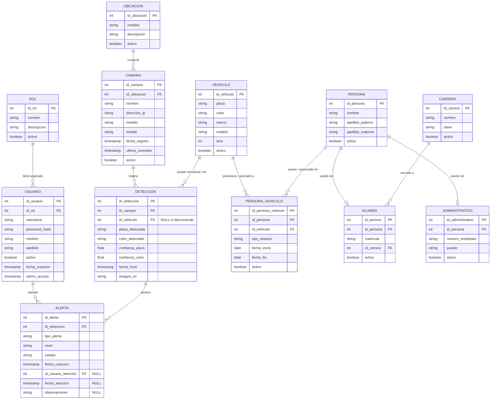

# VIGIA — Modelo conceptual de Base de Datos V1

## 1. Objetivo

El modelo conceptual de la base de datos V1 de VIGIA define las entidades necesarias para gestionar el acceso de personal de monitoreo, registrar personas pertenecientes a la institución, asociar vehículos con dichas personas, administrar cámaras y ubicaciones, almacenar las detecciones realizadas por el sistema de visión y generar alertas cuando se detecten vehículos que no se encuentren registrados.

El modelo busca mantener una estructura **simple, consistente y escalable**, evitando incorporar funcionalidades que no forman parte del alcance inicial de VIGIA.

---

# 2. Entidades principales

La versión 1 estará compuesta inicialmente por **12 entidades**:

```text
USUARIO
ROL
PERSONA
ALUMNO
ADMINISTRATIVO
CARRERA
VEHICULO
PERSONA_VEHICULO
UBICACION
CAMARA
DETECCION
ALERTA
```

Estas entidades representan los principales elementos del funcionamiento de VIGIA.

---

# 3. Identidad y acceso

## 3.1 ROL

Representa el tipo de usuario que puede utilizar el sistema.

```text
ROL
────────────────
id_rol PK
nombre
descripcion
activo
```

En V1 se utilizará principalmente:

```text
MONITORISTA
```

La estructura queda preparada para incorporar posteriormente otros roles, por ejemplo:

```text
ADMINISTRADOR
SUPERVISOR
MONITORISTA
```

sin necesidad de modificar la estructura principal de usuarios.

### Relación

```text
ROL 1 ───────── N USUARIO
```

Un rol puede estar asignado a múltiples usuarios.

---

## 3.2 USUARIO

Representa a las personas autorizadas para acceder al sistema VIGIA.

```text
USUARIO
────────────────
id_usuario PK
id_rol FK
username UNIQUE
password_hash
nombre
apellido
activo
fecha_creacion
ultimo_acceso
```

En V1, los usuarios serán principalmente personal de monitoreo.

La contraseña no se almacenará directamente, sino mediante un valor derivado mediante un mecanismo seguro de hashing.

---

# 4. Personas de la institución

## 4.1 PERSONA

Representa a una persona perteneciente a la institución.

```text
PERSONA
────────────────
id_persona PK
nombre
apellido_paterno
apellido_materno
activo
```

Los datos específicos de alumnos y personal administrativo se almacenan en sus respectivas entidades.

La matrícula no pertenece directamente a `PERSONA`, debido a que identifica específicamente a un alumno.

---

## 4.2 ALUMNO

Representa a una persona registrada como alumno de la institución.

```text
ALUMNO
────────────────
id_alumno PK
id_persona FK UNIQUE
matricula UNIQUE
id_carrera FK
activo
```

### Relaciones

```text
PERSONA 1 ───── 0..1 ALUMNO

CARRERA 1 ───── N ALUMNO
```

Una persona puede no ser alumno, mientras que cada alumno corresponde a una persona.

---

## 4.3 ADMINISTRATIVO

Representa a una persona que pertenece al personal administrativo de la institución.

```text
ADMINISTRATIVO
────────────────
id_administrativo PK
id_persona FK UNIQUE
numero_empleado UNIQUE
puesto
activo
```

### Relación

```text
PERSONA 1 ───── 0..1 ADMINISTRATIVO
```

La separación permite mantener los datos generales de la persona independientes de los datos específicos de su función institucional.

---

# 5. Carreras

## 5.1 CARRERA

Representa una carrera académica a la que puede pertenecer un alumno.

```text
CARRERA
────────────────
id_carrera PK
nombre
clave
activo
```

Ejemplos:

```text
Ingeniería de Software
Ingeniería Industrial
Administración
Contaduría
```

### Relación

```text
CARRERA 1 ───── N ALUMNO
```

Una carrera puede tener múltiples alumnos.

---

# 6. Vehículos

## 6.1 VEHICULO

Representa un vehículo registrado en VIGIA.

```text
VEHICULO
────────────────
id_vehiculo PK
placa UNIQUE
color
marca
modelo
anio
activo
```

La placa será el principal dato utilizado por VIGIA para determinar si un vehículo detectado ya se encuentra registrado.

---

## 6.2 PERSONA_VEHICULO

Representa la relación entre una persona y un vehículo.

```text
PERSONA_VEHICULO
────────────────
id_persona_vehiculo PK
id_persona FK
id_vehiculo FK
tipo_relacion
fecha_inicio
fecha_fin
activo
```

### Relación

```text
PERSONA 1 ───── N PERSONA_VEHICULO N ───── 1 VEHICULO
```

Esto permite que:

* una persona pueda tener más de un vehículo;
* un vehículo pueda relacionarse con una o más personas;
* una relación pueda tener vigencia;
* posteriormente puedan existir distintos tipos de relación.

En V1 se utilizará principalmente:

```text
tipo_relacion = PROPIETARIO
```

La estructura también permite evolucionar posteriormente hacia relaciones como:

```text
AUTORIZADO
TEMPORAL
COMPARTIDO
```

sin modificar la entidad `VEHICULO`.

---

# 7. Ubicaciones

## 7.1 UBICACION

Representa el lugar físico donde se encuentra instalada una cámara.

```text
UBICACION
────────────────
id_ubicacion PK
nombre
descripcion
activo
```

Ejemplos:

```text
Entrada principal
Estacionamiento
Entrada administrativa
Acceso norte
Acceso sur
```

### Relación

```text
UBICACION 1 ───── N CAMARA
```

Una ubicación puede tener una o varias cámaras.

---

# 8. Cámaras

## 8.1 CAMARA

Representa una cámara configurada para proporcionar información visual a VIGIA.

```text
CAMARA
────────────────
id_camara PK
id_ubicacion FK
nombre
direccion_ip
modelo
estado
fecha_registro
ultima_conexion
activo
```

Ejemplo:

```text
Entrada principal
       │
       ├── CAM-01
       └── CAM-02
```

La cámara será la fuente de las detecciones registradas por VIGIA.

---

# 9. Detecciones

## 9.1 DETECCION

Representa un vehículo identificado visualmente por una cámara.

```text
DETECCION
────────────────────────
id_deteccion PK
id_camara FK
id_vehiculo FK NULL
placa_detectada
color_detectado
confianza_placa
confianza_color
fecha_hora
imagen_uri
```

Una detección representa **lo que el sistema de visión observó**, independientemente de que el vehículo ya se encuentre registrado en VIGIA.

### `id_vehiculo` puede ser NULL

Cuando VIGIA detecta una placa:

```text
CÁMARA
   │
   ▼
DETECCIÓN
   │
   ▼
buscar placa
   │
   ├── encontrada
   │       │
   │       └── id_vehiculo = vehículo registrado
   │
   └── no encontrada
           │
           └── id_vehiculo = NULL
```

Esto permite conservar la detección incluso cuando el vehículo todavía no existe en el registro institucional.

---

# 10. Alertas

## 10.1 ALERTA

Representa una situación detectada por VIGIA que requiere atención del personal de monitoreo.

```text
ALERTA
────────────────────────
id_alerta PK
id_deteccion FK
tipo_alerta
nivel
estado
fecha_creacion
id_usuario_atencion FK NULL
fecha_atencion NULL
observaciones NULL
```

En V1 se contempla inicialmente:

```text
tipo_alerta
────────────────
VEHICULO_DESCONOCIDO
```

Estados iniciales:

```text
PENDIENTE
ATENDIDA
DESCARTADA
```

Una alerta puede ser atendida por un usuario autorizado de VIGIA.

---

# 11. Flujo de vehículo conocido

Cuando VIGIA detecta un vehículo cuya placa ya se encuentra registrada:

```text
                 CÁMARA
                    │
                    ▼
                DETECCIÓN
                    │
             placa = ABC-123
                    │
                    ▼
             buscar VEHICULO
                    │
                    ▼
                encontrado
                    │
                    ▼
          vehículo registrado
                    │
                    ▼
              SIN ALERTA
```

La detección queda registrada como parte del historial del sistema.

La existencia de una relación con una persona se determina mediante:

```text
VEHICULO
    │
    ▼
PERSONA_VEHICULO
    │
    ▼
PERSONA
    │
    ├── ALUMNO
    │
    └── ADMINISTRATIVO
```

La relación con una persona no se considera obligatoria para que el vehículo pueda existir en VIGIA.

---

# 12. Flujo de vehículo desconocido

Cuando VIGIA detecta una placa que no existe en la entidad `VEHICULO`:

```text
                 CÁMARA
                    │
                    ▼
                DETECCIÓN
                    │
             placa = XYZ-999
                    │
                    ▼
             buscar VEHICULO
                    │
                    ▼
               NO EXISTE
                    │
                    ▼
                  ALERTA
                    │
                    ▼
               MONITORISTA
                    │
             ┌──────┴──────┐
             │             │
             ▼             ▼
        Registrar       Descartar
         vehículo         alerta
             │
             ▼
          PERSONA
             │
             ▼
          VEHICULO
```

Una vez que el monitorista registra el vehículo y lo relaciona con una persona, las futuras detecciones de esa placa podrán identificarse como pertenecientes a un vehículo conocido.

---

# 13. Diferencia entre detección y vehículo registrado

VIGIA debe mantener una separación clara entre:

### Detección

Representa lo que la cámara observó.

```text
DETECCION
────────────────────
placa_detectada = ABC123
color_detectado = ROJO
fecha_hora = ...
```

### Vehículo registrado

Representa información conocida por VIGIA.

```text
VEHICULO
────────────────────
placa = ABC123
color = ROJO
```

Por lo tanto:

> **DETECCION = observación del sistema.**  
> **VEHICULO = registro conocido por el sistema.**

Esta separación permite conservar el historial de observaciones y posteriormente comparar los datos detectados con la información registrada.

Por ejemplo, VIGIA podría detectar una placa conocida pero un color diferente al registrado.

---

# 14. ERD conceptual V1

```text
                         ┌─────────────┐
                         │     ROL     │
                         └──────┬──────┘
                                │ 1:N
                                ▼
                         ┌─────────────┐
                         │   USUARIO   │
                         └──────┬──────┘
                                │
                                │ atiende
                                ▼
                         ┌─────────────┐
                         │   ALERTA    │
                         └──────┬──────┘
                                │ N:1
                                ▼
                         ┌─────────────┐
                         │  DETECCION  │
                         └──────┬──────┘
                                │
                         ┌──────┴───────┐
                         │              │
                         ▼              ▼
                  ┌─────────────┐ ┌─────────────┐
                  │   CAMARA    │ │  VEHICULO   │
                  └──────┬──────┘ └──────┬──────┘
                         │                │
                         │ N:1            │
                         ▼                │
                  ┌─────────────┐         │
                  │ UBICACION   │         │
                  └─────────────┘         │
                                          │
                                   N      1│
                              ┌───────────┘
                              ▼
                    ┌────────────────────┐
                    │ PERSONA_VEHICULO  │
                    └─────────┬──────────┘
                              │
                              ▼
                       ┌─────────────┐
                       │   PERSONA   │
                       └──────┬──────┘
                              │
                  ┌───────────┴───────────┐
                  │                       │
                  ▼                       ▼
           ┌─────────────┐        ┌───────────────┐
           │   ALUMNO    │        │ADMINISTRATIVO │
           └──────┬──────┘        └───────────────┘
                  │
                  │ N:1
                  ▼
           ┌─────────────┐
           │   CARRERA   │
           └─────────────┘
```

### Diagrama Entidad-Relación (Mermaid)



---

# 15. Reglas de negocio principales de V1

### RN-BD-01 — Identificación de vehículo
La placa será el dato principal utilizado para determinar si un vehículo ya se encuentra registrado en VIGIA.

### RN-BD-02 — Placa única
Una placa registrada no podrá estar asociada a múltiples registros activos de `VEHICULO`.

### RN-BD-03 — Registro de detecciones
Cada detección realizada por una cámara podrá conservarse independientemente de que el vehículo sea conocido o desconocido.

### RN-BD-04 — Vehículo desconocido
Cuando una detección corresponda a una placa que no exista en `VEHICULO`, VIGIA podrá generar una alerta de tipo `VEHICULO_DESCONOCIDO`.

### RN-BD-05 — Atención de alertas
Una alerta podrá ser atendida por un usuario autorizado para operar VIGIA.

### RN-BD-06 — Asociación institucional
Un vehículo podrá asociarse mediante `PERSONA_VEHICULO` con una persona registrada en la institución.

### RN-BD-07 — Identificación de alumnos
La matrícula identificará de manera única a un alumno.

### RN-BD-08 — Historial
Las detecciones representan eventos históricos y no deberán modificarse simplemente porque posteriormente se registre el vehículo detectado.

### RN-BD-09 — Separación de responsabilidades
La información observada por el sistema (`DETECCION`) deberá mantenerse separada de la información administrativa registrada (`VEHICULO`, `PERSONA` y sus relaciones).

---

# 16. Alcance de V1

Quedan explícitamente fuera del modelo V1:

* Reconocimiento facial.
* Listas negras.
* Reconocimiento de personas.
* Seguimiento de vehículos entre cámaras.
* Control automático de barreras.
* Historial de propietarios complejo.
* Vehículos de terceros.
* Pagos.
* Gestión avanzada de estacionamientos.
* GPS.
* IA compleja dentro de la base de datos.

Estas funcionalidades podrán incorporarse en versiones posteriores si los requerimientos del sistema las justifican.

---

# 17. Estado del modelo

* **Versión:** V1  
* **Estado:** Modelo conceptual propuesto  
* **Motor de BD objetivo:** PostgreSQL  
* **Alcance:** Seguridad y monitoreo vehicular institucional  

El modelo V1 constituye la base para elaborar posteriormente el **modelo lógico y físico de la base de datos**, donde se definirán tipos de datos específicos, restricciones de integridad, claves foráneas, índices, reglas `CHECK`, comportamiento referencial `ON DELETE` / `ON UPDATE` y demás elementos técnicos propios de PostgreSQL.
